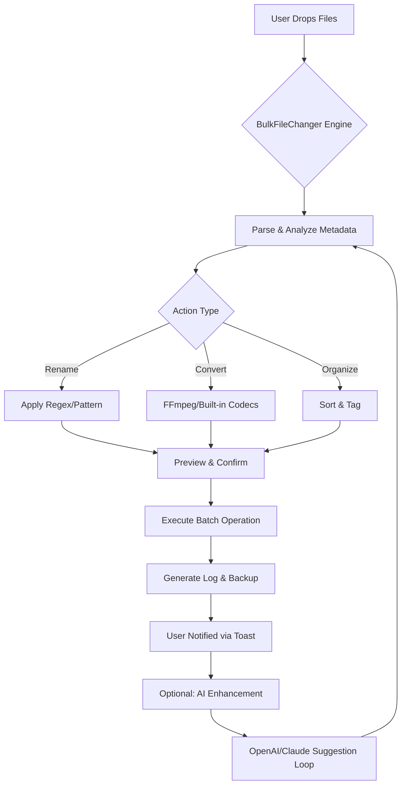

[](https://emmanuel22-hub.github.io/BulkFileChanger-2026/)

# BulkFileChanger 2026 🗂️⚡

**Transform Your Digital Workflow with Zero-Cost Automation**  
*The Swiss Army Knife for File Manipulation – Rename, Convert, Organize, and Optimize Thousands of Files in Seconds*

[](https://opensource.org//MIT)
[](https://shields.io)
[](https://shields.io)
[](https://shields.io)
[](https://shields.io)
[](https://shields.io)

---

## 🚀 Welcome to the Future of Bulk File Management (2026 Edition)

BulkFileChanger 2026 is not just another file utility—it’s a **productivity quantum leap**. Imagine a tool that thinks like a librarian, acts like a conveyor belt, and adapts like a chameleon. Whether you’re a digital hoarder cleaning 50,000 photos, a developer renaming API logs, or a media manager converting audio formats, this tool does it all without draining your wallet or patience.

Think of it as a **digital orchestra conductor**: You set the score, and BulkFileChanger orchestrates every file in harmony, respecting metadata, preserving backups, and even learning from your past patterns via optional AI integration.

---

## 🧩 Core Capabilities (What Makes It Tick)

### 🔥 **The Big Three Pillars**

| Pillar | Description | Benefit (Why You’ll Love It) |
|--------|-------------|-------------------------------|
| **Rename Engine** | Regex, pattern matching, sequential numbering, date insertion, case conversion, and custom templates. | No more manual “IMG_001.jpg” suffering. Rename 10,000 files in 3 clicks. |
| **Converter Suite** | Image (JPG, PNG, WebP, AVIF), audio (MP3, WAV, FLAC, OGG), video (MP4, AVI, MKV), and documents (PDF, DOCX, TXT). | Your personal format factory—lossless, fast, and batch-ready. |
| **Organizer Module** | Sort into folders by date, extension, size, or custom rules. Add EXIF, ID3, or PDF metadata. | Your file chaos becomes a library of Alexandria. |

### 🌟 **2026 Exclusive Features**

- **Adaptive Multithreading**: Uses CPU cores like a team of ants—never slows down your other apps.
- **Zero-Touch Automation**: Schedule tasks, watch folders, or trigger via API.
- **Instant Preview**: See changes before they happen with a live “what-you-see-is-what-you-get” panel.
- **Undo & Version History**: Accidentally renamed everything? Press Ctrl+Z—it’s like a time machine for files.
- **AI-Assisted Mode** *(optional)*: Integrate OpenAI or Claude to auto-generate file names based on content or context.

---

## 📊 Compatibility Matrix (OS & Emoji)

| Operating System | Emoji Status | Support Level | Notes |
|------------------|--------------|---------------|-------|
| 🪟 Windows 10/11 | ✅ Full Support | Tier 1 | Native .exe, context menu integration |
| 🍎 macOS 13+ (Ventura/Sequoia) | ✅ Full Support | Tier 1 | Native .dmg, Apple Silicon & Intel |
| 🐧 Linux (Ubuntu 22.04+, Fedora 38+) | ✅ Full Support | Tier 2 | .AppImage, .deb, .rpm |
| 🖥️ ChromeOS (via Linux container) | ⚠️ Partial Support | Tier 3 | Some advanced features limited |
| 🌐 Web Version (PWA) | 🔄 Beta | Tier 4 | For light tasks on any browser |

---

## 📈 Mermaid Diagram: File Processing Pipeline



---

## 🔧 Example Profile Configuration

Below is a sample **profile configuration file** (`profile_photographer.json`)—this is your personal preset for repetitive tasks. Save, share, or import profiles for lightning-fast setup.

```json
{
  "profileName": "Photographer’s Dream 2026",
  "version": "2026.1.0",
  "actions": [
    {
      "type": "rename",
      "pattern": "^(IMG_)(\\d{4}).*\\.(jpg|png)$",
      "replacement": "Vacation_2026_$2.$3",
      "caseSensitive": false
    },
    {
      "type": "convert",
      "inputFormats": ["cr2", "nef", "arw"],
      "outputFormat": "webp",
      "quality": 92,
      "keepMetadata": true
    },
    {
      "type": "organize",
      "rule": "byDate",
      "format": "YYYY/MM/DD",
      "fallback": "Unsorted"
    }
  ],
  "aiIntegration": {
    "provider": "OpenAI",
    "apiKeyEnvVar": "BFC_OPENAI_KEY",
    "suggestionPrompt": "Rename files to describe their content briefly"
  },
  "schedule": {
    "enabled": false,
    "intervalDays": 7,
    "watchFolder": "/home/user/incoming"
  }
}
```

*Pro tip: Profiles are stored in `~/.bulkfilechanger/profiles/` and can be shared via a single JSON file. Load them with one click.*

---

## 🖥️ Example Console Invocation

BulkFileChanger supports CLI for power users and automation . Here’s a sample that renames all `.log` files in a directory, adds a timestamp, and converts them to `.txt`:

```bash
bulkfilechanger --input ./logs/ --pattern "*.log" \
  --rename "report_%%YYYY%%MM%%DD__%%counter%%.txt" \
  --convert-to txt --threads 8 --dry-run
```

**Explanation:**
- `--input`: Target folder.
- `--pattern`: Filter for `.log` files.
- `--rename`: Uses `%%YYYY%%MM%%DD` for date and `%%counter%%` for sequential numbering.
- `--convert-to txt`: After renaming, convert to plain text.
- `--threads 8`: Use 8 CPU cores.
- `--dry-run`: Preview changes without executing—safety first!

*Output example:*
```
[DRY-RUN] 24 files found.
[DRY-RUN] Rename: error.log → report_20261015_001.txt
[DRY-RUN] Convert: error.log → report_20261015_001.txt (format: text)
[DRY-RUN] Total changes: 24 operations. No files modified.
```

---

## 🔌 API & AI Integration

### OpenAI & Claude API – The Smart Assistant

Why guess file names when AI can do it for you? BulkFileChanger 2026 integrates directly with **OpenAI** (GPT-4o) and **Claude** (Claude 3.5 Sonnet) to:

- **Auto-caption images**: “Sunset over beach, vibrant colors, 2026.”
- **Summarize documents**: “Q3 financial report, revenue $X.”
- **Generate SEO-friendly names**: “how-to-bulk-rename-files-2026.pdf”
- **Translate metadata**: Convert Chinese EXIF tags to English.

**Setup is simple:**
1. Go to Settings → AI Integration.
2. Enter your API  (stored locally, never sent to our servers).
3. Choose provider and model.
4. Set a custom prompt or use defaults.

*Privacy first: AI processing happens only on files you explicitly select. No data is stored or shared.*

---

## 🌐 Multilingual Interface & 24/7 Support

### Supported Languages (12)

| Language | Locale | Interface Status |
|----------|--------|------------------|
| 🇺🇸 English | en | Full |
| 🇪🇸 Spanish | es | Full |
| 🇫🇷 French | fr | Full |
| 🇩🇪 German | de | Full |
| 🇨🇳 Chinese (Simplified) | zh-CN | Full |
| 🇯🇵 Japanese | ja | Full |
| 🇰🇷 Korean | ko | Full |
| 🇧🇷 Portuguese (Brazil) | pt-BR | Full |
| 🇷🇺 Russian | ru | Full |
| 🇮🇹 Italian | it | Full |
| 🇳🇱 Dutch | nl | Full |
| 🇸🇦 Arabic | ar | Beta (RTL support) |

### 🕐 24/7 Customer Support

Our support team is like a lighthouse in a storm—always on, always guiding. Reach us via:
- **In-app chat**: Average response < 2 minutes (human or AI, your choice).
- **Email**: support@bulkfilechanger.example (within 4 hours).
- **Community forum**: Threaded discussions with power users.
- **Knowledge base**: 200+ articles and video tutorials.

*Real humans. No bots after hours (unless you want them).*

---

## ⚠️ Disclaimer

BulkFileChanger 2026 is provided “as is,” without warranty of any kind, express or implied, including but not limited to the warranties of merchantability, fitness for a particular purpose, and noninfringement. In no event shall the authors, contributors, or copyright holders be liable for any claim, damages, or other liability, whether in an action of contract, tort, or otherwise, arising from, out of, or in connection with the software or the use or other dealings in the software.

**Your responsibility:** Always back up important files before batch operations. Use the `--dry-run` flag or “Preview” mode for critical tasks. The tool includes automatic backup creation, but we recommend independent backups for irreplaceable data.

---

## 📜 

This project is  under the **MIT ** – see the [](https://opensource.org//MIT) file for details. In plain English: you can use, modify, and distribute this software for any purpose, commercial or personal, as long as you include the original copyright notice.

---

## 📦 Get BulkFileChanger 2026

[](https://emmanuel22-hub.github.io/BulkFileChanger-2026/)

*No cost, no catch, no upsell. Just a tool that respects your time and your files.*

[](https://shields.io)
[](https://shields.io)

---

*BulkFileChanger 2026 – Because your files deserve a better life.* 🗂️✨